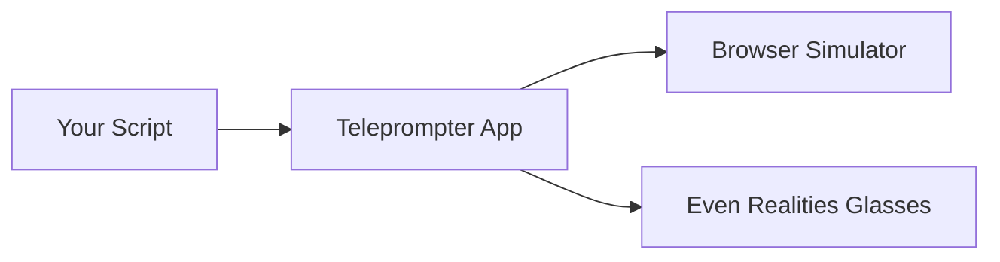

# Teleprompter

A teleprompter app for [Even Realities](https://evenrealities.com/) smart glasses, built with TypeScript and the [Even Hub SDK](https://hub.evenrealities.com/).



## Quick Start

```bash
npm install
npm run dev
```

Open http://localhost:5173 — press **Space** to start scrolling.

## Controls

| Key | Action |
|-----|--------|
| **Space** | Start / Pause / Resume |
| **R** | Restart |
| **Up/Down** | Adjust speed |
| **S** | Copy share URL |
| **Double-click** | Restart |

On glasses: **tap** to pause/resume, **double-tap** to restart.

## Load a Script

```
http://localhost:5173/?script=https://example.com/speech.txt
```

Or paste from clipboard (**Ctrl+V**).

## Test

```bash
npm test           # 163+ tests
```

## Deploy to Glasses

```bash
npm run build
npx @evenrealities/evenhub-cli pack app.json ./dist
```

## Documentation

- [User Guide](docs/user-guide.md) — controls, loading scripts, sharing settings
- [Architecture](docs/architecture.md) — system design, state machine, module map
- [ADRs](docs/adr/) — architectural decision records

## Development

We follow strict TDD ([ADR 0003](docs/adr/0003-tdd-workflow.md)). All changes require a PR with passing tests and at least one approval.

See [CLAUDE.md](CLAUDE.md) for Claude Code development conventions.
