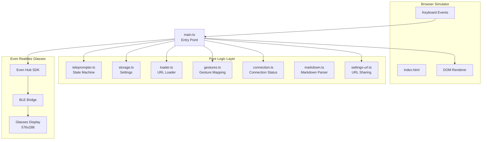
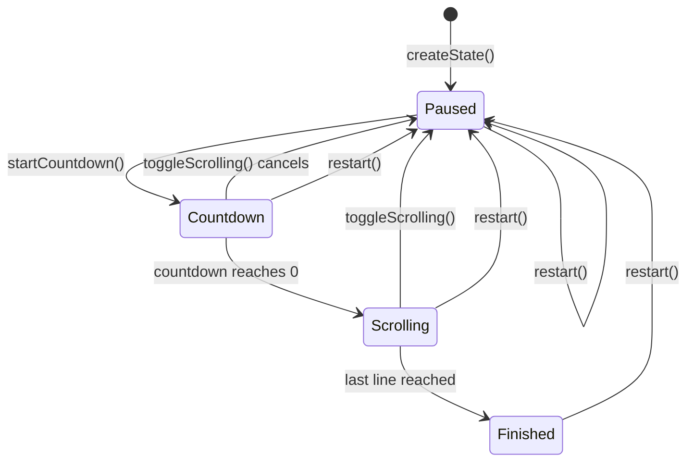
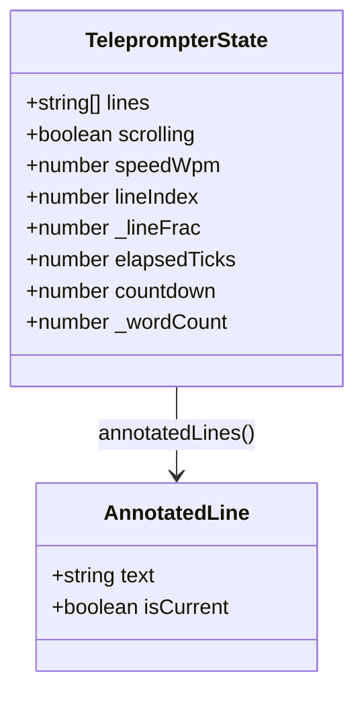
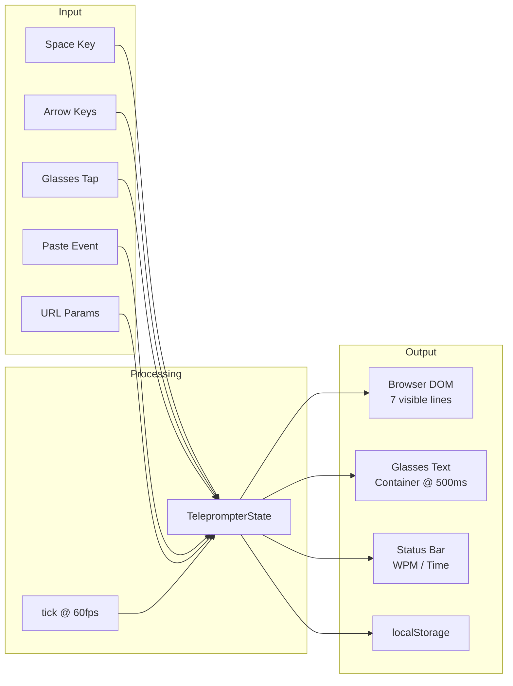
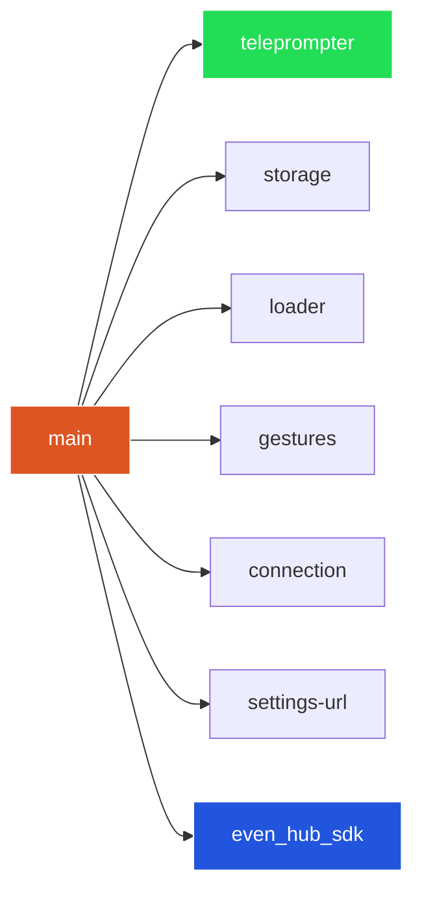

# Architecture

## System Overview

## State Machine

The core of the app is a pure state machine in `teleprompter.ts`. All state transitions are pure functions that take the current state and return a new state.

## State Shape

## Data Flow

## Module Dependencies

Green = pure logic (no side effects), Red = entry point (side effects), Blue = external SDK.

## Rendering Pipeline

### Browser (60fps)

1. `tick(state)` advances state
2. If state changed (reference check), `renderBrowser()` runs:
   - Clear `#script-text` innerHTML
   - Create `
` per visible line (7 lines)
   - Apply highlight to current line (white, larger, left border)
   - Apply `translateY` for smooth sub-pixel scrolling via `_lineFrac`
   - Update status bar text

### Glasses (500ms interval)

1. Build `glassesContent()` = script text + status line
2. Skip if content string unchanged since last push
3. Send via `bridge.textContainerUpgrade()`

## Display Constraints

| Property | Value |
|----------|-------|
| Canvas width | 576px |
| Canvas height | 288px |
| Max text per container | 2000 chars |
| Max containers per page | 4 |
| Text encoding | ASCII only (LVGL limitation) |
| Line width | 40 chars (CHARS_PER_LINE) |
