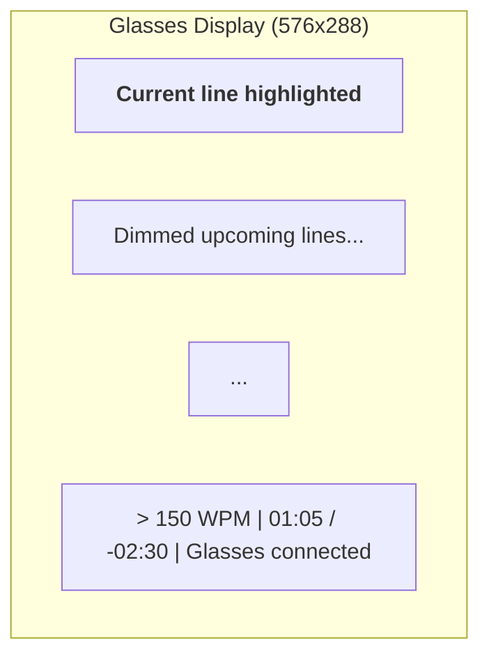

# User Guide

## Getting Started

### Browser Simulator

```bash
npm install
npm run dev
```

Open http://localhost:5173 to see the glasses simulator.

### Even Realities Glasses

Use the [even-dev simulator](https://github.com/BxNxM/even-dev) for testing:

```bash
git clone https://github.com/BxNxM/even-dev.git
cd even-dev && npm install
APP_PATH=../teleprompter ./start-even.sh
```

Or deploy to real glasses:

```bash
npm run build
npx @evenrealities/evenhub-cli pack app.json ./dist
```

## Controls

### Browser Keyboard

| Key | Action |
|-----|--------|
| **Space** | Start countdown / Pause / Resume |
| **R** | Restart from beginning |
| **Up Arrow** | Speed up (+10 WPM) |
| **Down Arrow** | Slow down (-10 WPM) |
| **S** | Copy share URL to clipboard |
| **Double-click** | Restart from beginning |
| **Ctrl+V** | Load script from clipboard |

### Glasses Gestures

| Gesture | Action |
|---------|--------|
| **Single tap** | Pause / Resume |
| **Double tap** | Restart from beginning |
| **Swipe (list index 0)** | Speed up |
| **Swipe (list index 1)** | Slow down |

## Loading Scripts

### From URL

Add `?script=` to load a remote text file:

```
http://localhost:5173/?script=https://example.com/my-speech.txt
```

### From Clipboard

1. Copy your script text
2. Click the simulator window
3. Press **Ctrl+V** (or **Cmd+V** on Mac)

### Default Script

If no script is provided, the Gettysburg Address is displayed.

## Sharing Settings

Press **S** to copy a URL with your current speed setting to the clipboard:

```
http://localhost:5173/?speed=180
```

Combine with a script URL:

```
http://localhost:5173/?speed=180&script=https://example.com/speech.txt
```

## Display



### Status Bar

When scrolling:
```
> 150 WPM | 01:05 / -02:30 | Browser only
```

When paused:
```
|| 271 words | ~01:48 | Browser only
```

- **WPM** — current scroll speed
- **Elapsed / Remaining** — time tracking
- **Word count / Read time** — shown when paused
- **Connection** — glasses status

## Countdown

When you press **Space** to start, a 3-second countdown (3... 2... 1...) appears before scrolling begins. Press **Space** again during the countdown to cancel.

## Persistence

Your speed setting is automatically saved to localStorage and restored on next visit. On glasses, settings sync via the Even Hub bridge storage.
